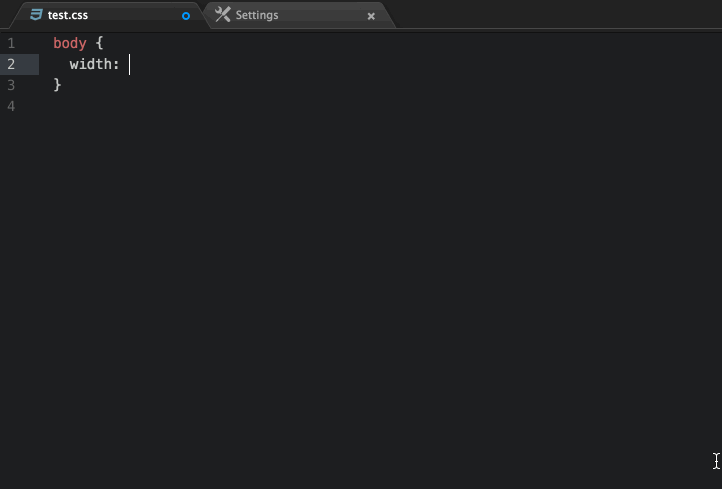

# pxtorem 

A package that turn your pixels text into rem.

## Options
* `addMark:true`: Add origin pixel value like /* 100/75 */
* `baseSize:75`: This will change the base size to convert px to rem
* `Precision:2`: The number of digits to the right of the decimal point
